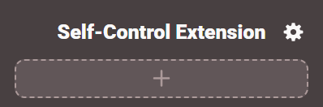
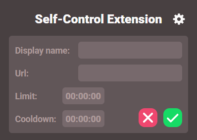
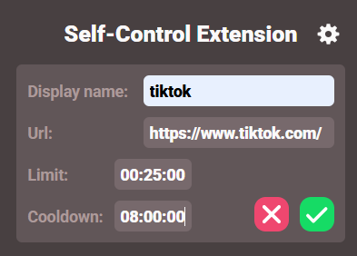
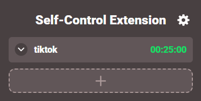
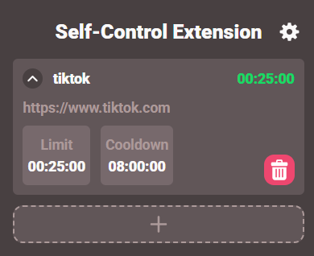
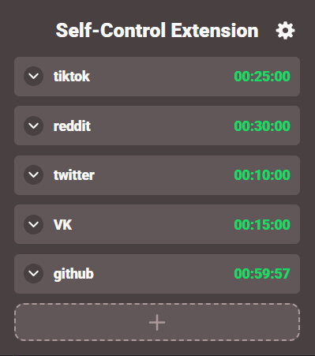
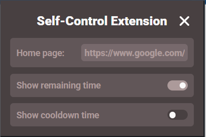

The Self-Control Chrome Extension is a parent-control application — but you are your own parent.  
That means you can set time restrictions on the websites you waste too much time on and become more productive!  
It's really easy to use this extension:
### 1. Open it:  
     
   As you can see there is nothing there yet — but let's change it!  
     
### 2. Add a new website  
     
   After pressing the plus button you'll see the form you have to fill in, nothing hard👍  
     
   There we go👆  
     
   As you can see we've added a restriction for tiktok  
     
   But what if you forgot how much time you allowed? Or you named it with some strange name and can't remember witch site it was for😵‍💫...  
     
   No problem, you can expand the block and see the details🤩 (and also remove the restriction from there)  
     
### 3. That's it  
If you spend too much time on a site, you'll be kicked and locked out until the cooldown is over😴  
     
You can add more sites to control our behaviour  

---
### There is also some settings

1. If there's only one tab open in your browser, it will be replaced with a home page
2. Hide the remaining time and don't stare at it
3. Do not be tempted to peek at the remaining cooldown, if it's hidden

---
Known issuse: this extension updates in real time only while the popup is open, the background process ticks only once per minute.